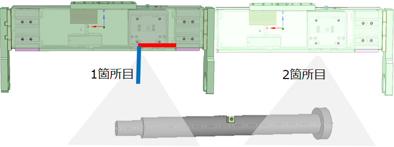
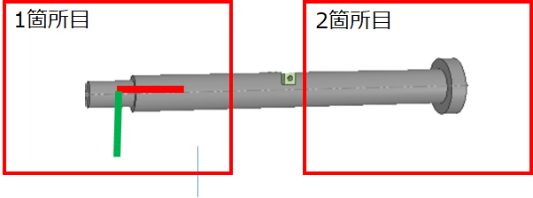
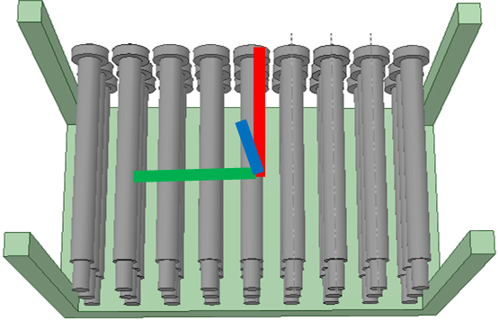

# rovi_csp

## 座標系の取り決め

### 撮影箇所  

撮影箇所は2箇所以上が必要です。最後の撮影点(右図では2箇所目)から最短距離で把持点に移動できるようにします。
 

### ワークの座標系  

ワークをカメラから俯瞰したのが右図です。先の撮影箇所を選ぶことで、このような座標系(カメラ座標系)が取られます。
 

### バケットの座標系  

バケット座標系はバケットの中心を原点とし、ワークのX方向が同じ向きになるようにした座標系が、右図のようなバケット座標系です。
Z軸(青)を天地逆転させているので、Y軸(緑)の方向が異なります。
この座標系はロボットのユーザ座標系としても共用します。
 
